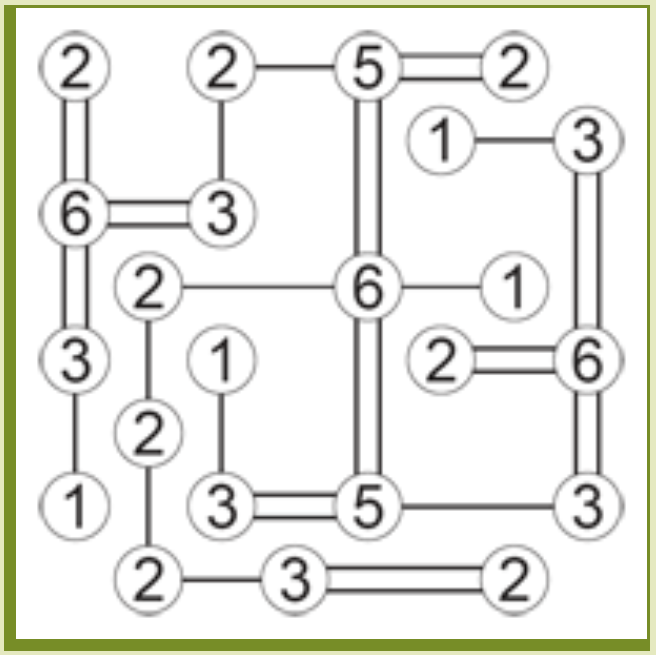

# Solver for Hashi puzzles

### Prerequisites
Required:
- `python` (developed in 3.8, not sure about other versions)
- `numpy`

Optional:
- `bokeh` (for the graphical interface)
- `matplotlib` and `PyQt5` (for an alternative graphical interface)

### Preparing the input
You'll need your Hashi puzzle to solve in the form of a `.txt` file.
Use a single digit (the number of connection to make) for each vertex, and a dash (`-`) for positions without a vertex.
Consider the following example:


The corresponding `.txt` file would look like this:

```
2-2-5-2-
-----1-3
6-3-----
-2--6-1-
3-1--2-6
-2------
1-3-5--3
-2-3--2-
```

### Running the solver
Use `python solve.py <path to input file>`.
Using the example from above, the terminal output will look like this:

```
-----------------
|2   2   5   2  |
|               |
|          1   3|
|               |
|6   3          |
|               |
|  2     6   1  |
|               |
|3   1     2   6|
|               |
|  2            |
|               |
|1   3   5     3|
|               |
|  2   3     2  |
-----------------
-----------------
|2   2---5===2  |
|"   |   "      |
|"   |   " 1---3|
|"   |   "     "|
|6===3   "     "|
|"       "     "|
|" 2-----6---1 "|
|" |     "     "|
|3 | 1   " 2===6|
|| | |   "     "|
|| 2 |   "     "|
|| | |   "     "|
|1 | 3===5-----3|
|  |            |
|  2---3=====2  |
-----------------
Complete: True
```

which in turn corresponds to the following solved puzzle:



### Using the graphical interface
See the dedicated instructions in the `gui-bokeh` or `gui-pyqt5` folders.

### Using images instead of txt files as input
To do
