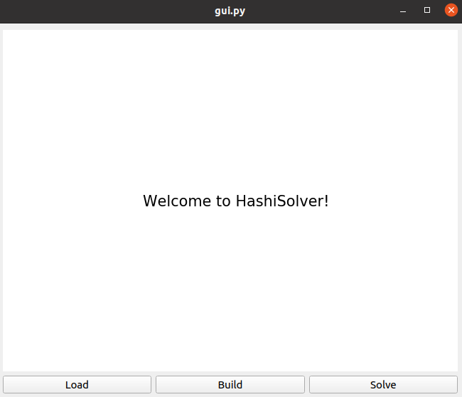
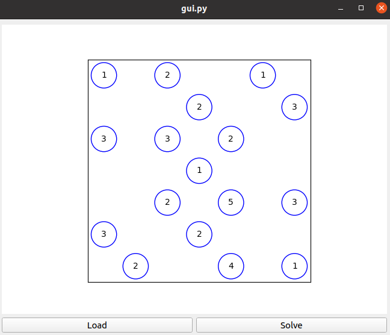
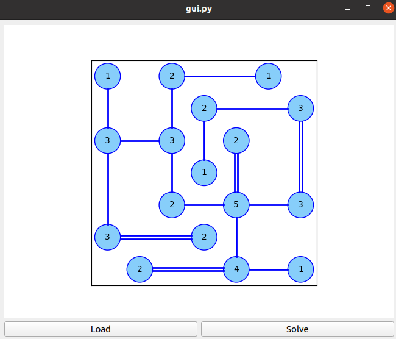
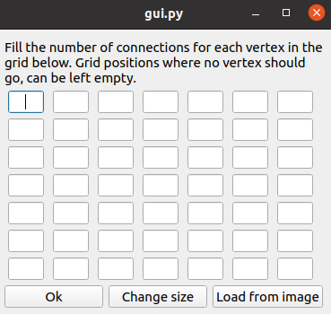
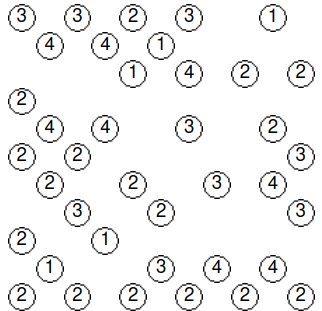
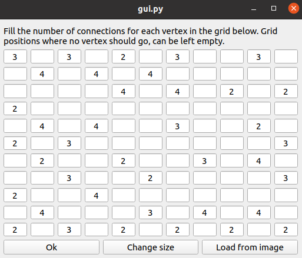
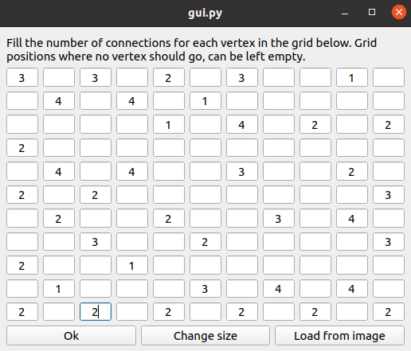
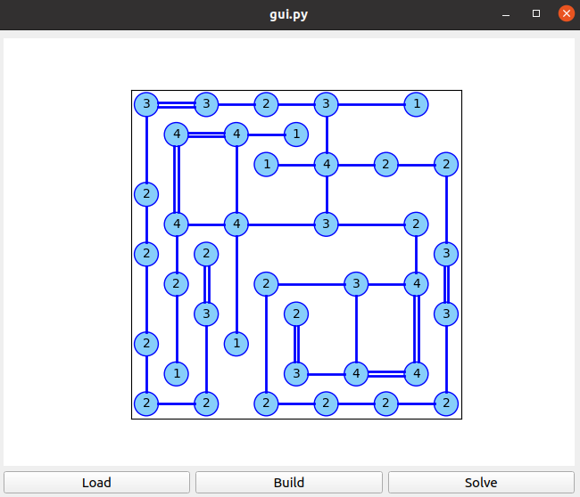

# Graphical interface implementation with PyQt5 and matplotlib

There is also an older `bokeh` based approach (see the [gui-bokeh](https://github.com/LukaLambrecht/HashiSolver/gui-bokeh) folder), but that one is outdated and not recommended anymore.

### Prerequisites
On top of the general prerequisites (see the [general instructions](https://github.com/LukaLambrecht/HashiSolver)), you'll need the `matplotlib` and `PyQt5` packages.
The former can be installed with (for example) `pip3 install matplotlib`, and the latter with `pip3 install 'PyQt5<5.15'` (the version restriction seems to be needed to avoid conflicts).

Optionally, for using the image reader (see below), you'll need the `opencv` package as well. It can be installed with `pip3 install opencv-python`.

### Preparing the input
You'll need your Hashi puzzle to solve in the form of a `.txt` file.
See the [general instructions](https://github.com/LukaLambrecht/HashiSolver) for more info.

### Launching the GUI
Run `./launch.sh` or alternatively `python3 gui.py`.

### Using the GUI with prepared input file
After launching the GUI, you will see this display:

Click the `Load` button, navigate to your prepared input `.txt` file, and open it. For example:

Then click the `Solve` button. If the puzzle can be solved, you will see something like this:

### Using the GUI with interactive builder
Instead of preparing a `.txt` file as above, you can also build the Hashi interactively.
After launching the GUI, click the `Build` button, and you will see a popup window like this:

Change the size of the grid if needed, and fill the required number of connections in the appropriate locations. Then click `Ok`.
See also below for an example.

### Using the GUI with image reader
Another possibility is to use an image (e.g. a screenshot) as input.
Note that this feature does not yet work perfectly, but for clean screenshots (such as the one in the example below), you should get a reasonable estimate, that you can then modify interactively.

Open the GUI and press the `Build` button, then press `Load from image` and select your input image.
For example, we use the following image:

Which results in the following grid:

The topology is fine, but some digits are not recognized correctly.
Make the required modifications to end up with this:

Then press `Ok` and then `Solve`. Here is the result:

